## Project: Kinematics Pick & Place

### Kinematic Analysis
#### 1. Run the forward_kinematics demo and evaluate the kr210.urdf.xacro file to perform kinematic analysis of Kuka KR210 robot and derive its DH parameters.
Before we can derive the KR210's DH parameters, we first draw and label the Kuka arm:
   1. We draw the Kuka arm's initial position
   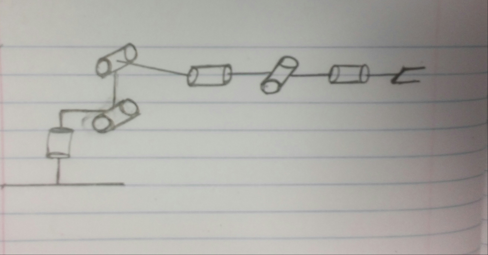
   
   2. We then label all the joints and define the joint axes by drawing a line through each joint
        * We can observe that joints 2, 3, and 5 are parallel and joints 4 and 6 are coincident
        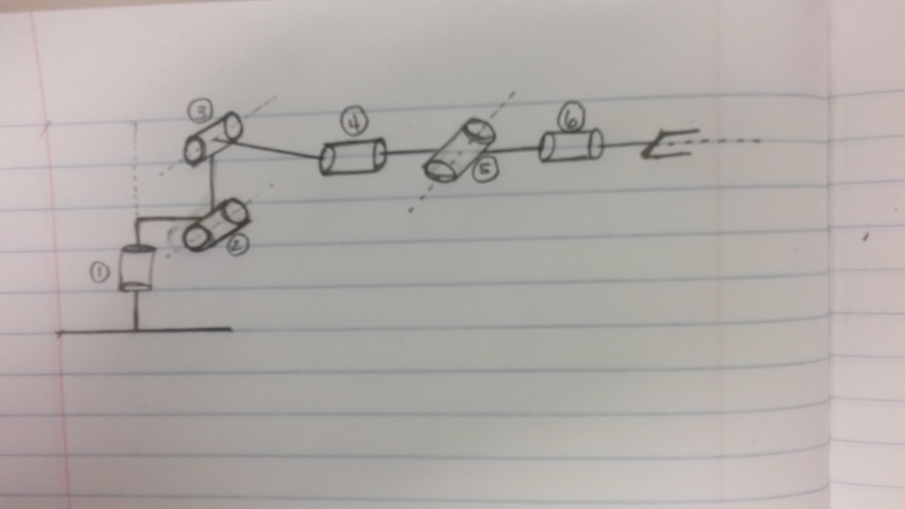
   
   3. Label all the links
   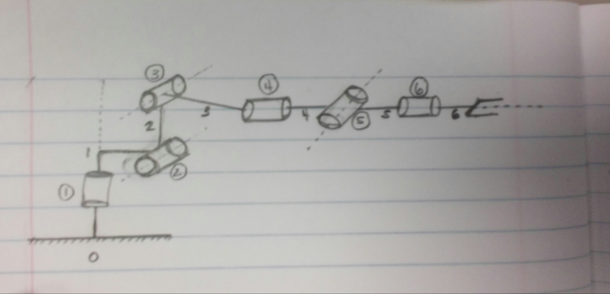
   
   4. Define directions of the Z axis 
   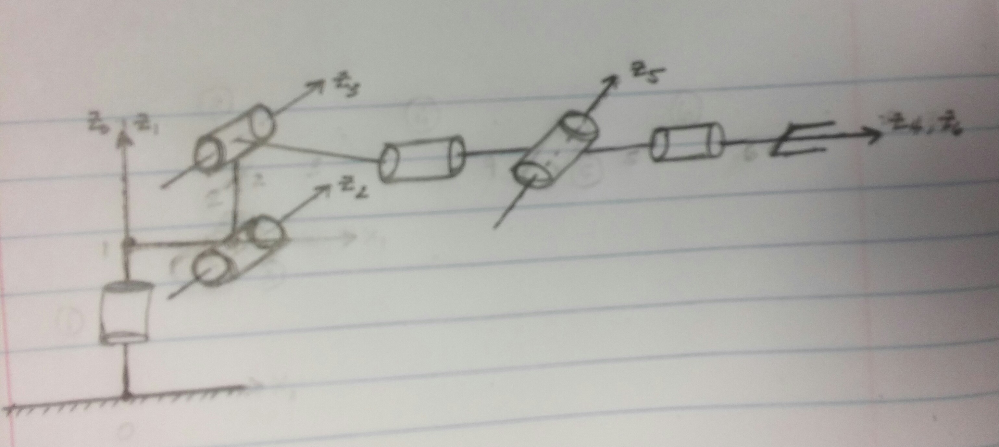
   
   5. Define directions of the X axis or common normals and reference frame origins
   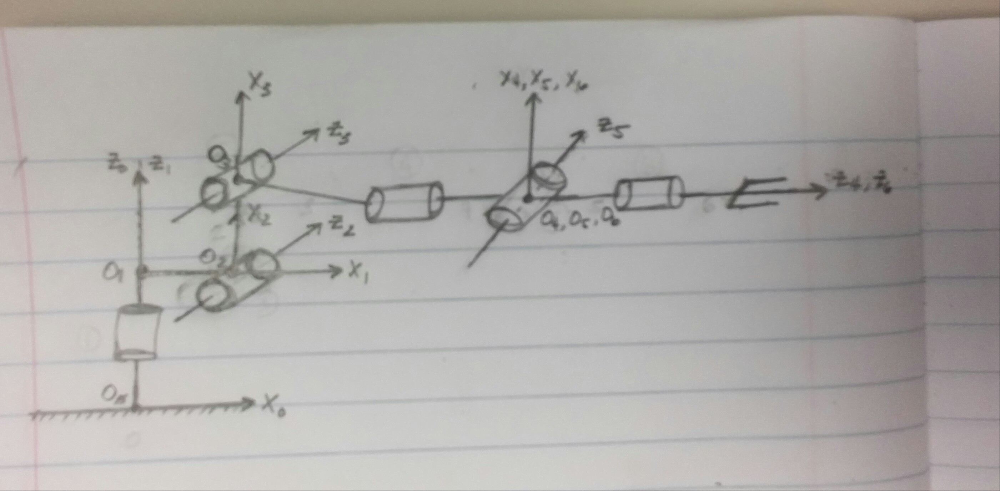
       * We'll add another frame for the gripper since this is the point we ultimately care about, it'll represent a 
       point on the EE. It differs from frame 6 only by a translation along the Z_6 axis.
       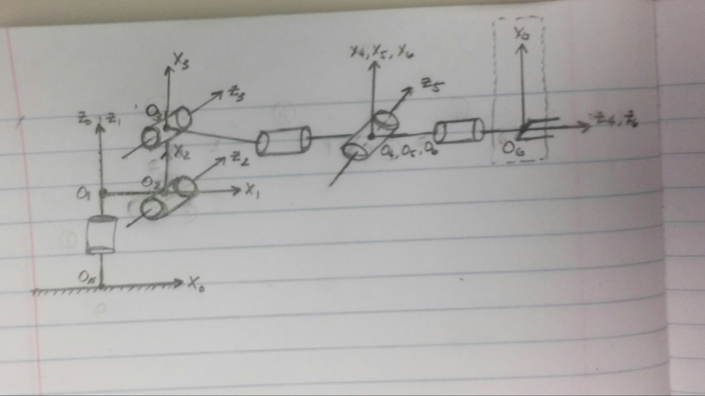
       
   6. Label and show the locations of the nonzero link lengths (a_i-1) and link offsets (d_i)
       * link length (a_i-1) = the distance between Z_i-1 to Z_i measured along X_i-1 where X_i-1 is perpendicular to both Z axes
       * link offset (d_i) = signed distance from X_i-1 to X_i measured along the Z_i.
       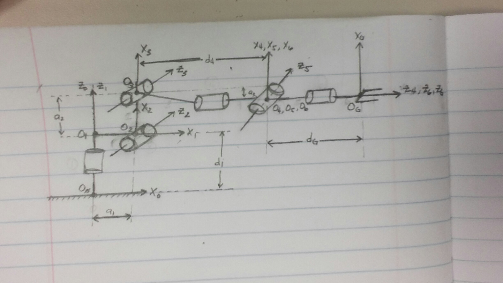
   
   7. Derive the twist angles of the robot arm
   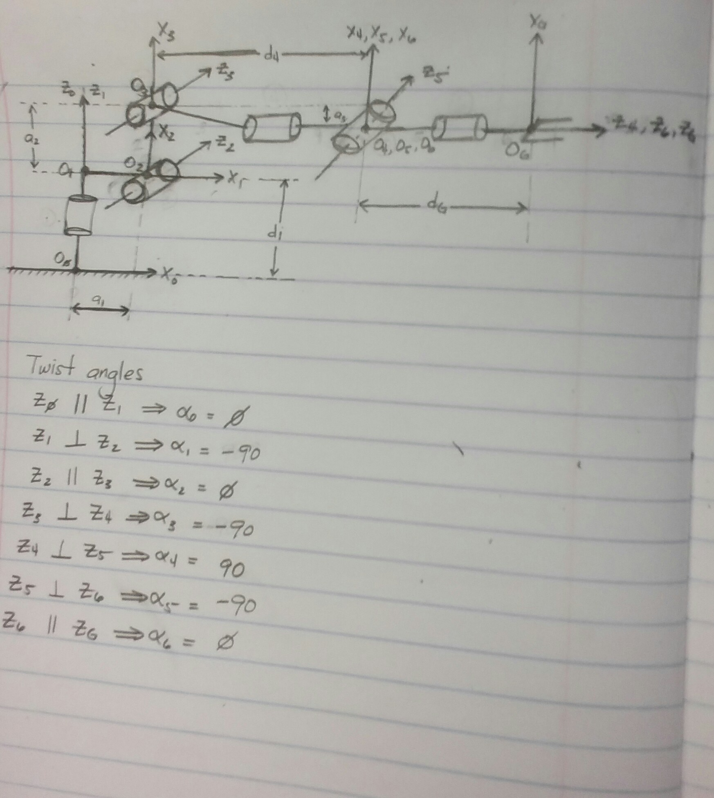

Finally we can create our table based on the drawing
##### DH Parameter Table

Links | alpha(i-1) | a(i-1) | d(i) | theta(i)
:---: | :---:      | :---:  | :---:  | :---:
0->1  |  0         | 0      | d1     | 
1->2  | alpha1     | a1     | 0      | theta2 + q2
2->3  |  0         | a2     | 0      | 
3->4  | alpha2     | a3     | d4     | 
4->5  | alpha3     | 0      | 0      | 
5->6  | alpha4     | 0      | 0      | 
6->EE |  0         | 0      | dG     | 0

After evaluating the kr210.urdf.xacro file, we can now fill in the variables
with actual numbers:

##### DH Parameter Table
Links | alpha(i-1) | a(i-1) | d(i) | theta(i)
:---: | :---:      | :---:  | :---:  | :---:
0->1  |  0         | 0      | 0.75   | 
1->2  | -90        | 0.35   | 0      | -90 + q2
2->3  |  0         | 1.25   | 0      | 
3->4  | -90        | -0.054 | 1.5    | 
4->5  |  90        | 0      | 0      | 
5->6  | -90        | 0      | 0      | 
6->EE |  0         | 0      | 0.303  | 0
   

#### 2. Using the DH parameter table you derived earlier, create individual transformation matrices about each joint. In addition, also generate a generalized homogeneous transform between base_link and gripper_link using only end-effector(gripper) pose.
From the lectures, we know that the generalized homogeneous transforms consists of 2 rotations and 2 translations:
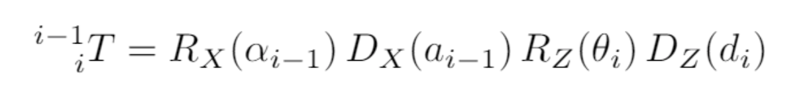
   * **Rx(alpha_i-1)** = rotation about the X_i-1 axis by alpha_i-1
   * **Dx(a_i-1)** = translation about the X_i-1 axis by a_i-1
   * **Rz(theta_i)** = rotation about the Z_i axis by theta_i
   * **Dz(d_i)** = translation about the Z_i axis by d_i

We can expand the generalized equation to a matrix form:
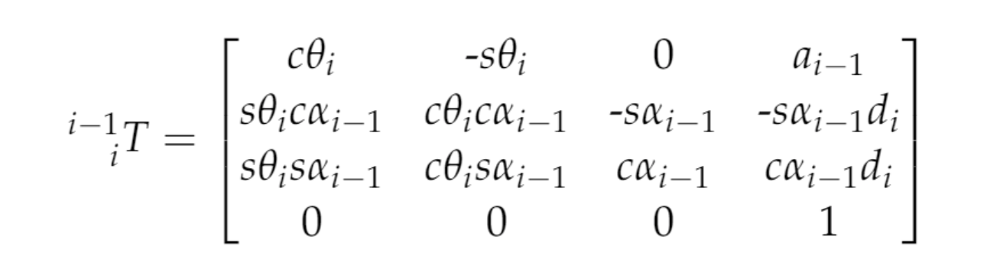

From here, we'll use this equation to create the individual matrices for each joint.

  1. Let's create our symbols first to use for the transforms
      ```
        ### Create symbols for joint variables
        q1, q2, q3, q4, q5, q6, q7 = symbols('q1:8')
        d1, d2, d3, d4, d5, d6, d7= symbols('d1:8')
        a0, a1, a2, a3, a4, a5, a6= symbols('a0:7')
        alpha0, alpha1, alpha2, alpha3, alpha4, alpha5, alpha6 = symbols('alpha0:7')
      ```

  2. After we create our symbols, we'll convert the DH table into a dictionary
      ```
        # DH Parameters
        s = {alpha0:     0,  a0:      0,   d1:  0.75, 
             alpha1: -pi/2,  a1:   0.35,   d2:     0,   q2: q2 - pi/2,
             alpha2:     0,  a2:   1.25,   d3:     0, 
             alpha3: -pi/2,  a3: -0.054,   d4:   1.5,
             alpha4:  pi/2,  a4:      0,   d5:     0,
             alpha5: -pi/2,  a5:      0,   d6:     0,
             alpha6:     0,  a6:      0,   d7: 0.303,   q7: 0         }    
      ```
	  
  3. We'll create a method for the generalized transform matrix:
      ```
        def homogeneous_transform(alpha, a, d, q):
            return Matrix([[           cos(q),            -sin(q),           0,             a],
                           [sin(q)*cos(alpha),  cos(q)*cos(alpha), -sin(alpha), -sin(alpha)*d],
                           [sin(q)*sin(alpha), cos(q)*sin(allpha),  cos(alpha),  cos(alpha)*d],
                           [                0,                  0,           0,             1]])
      ```
	  
  4. We can now create our individual transforms by calling this method and using the DH dictionary created and substituting
  it in:
      ```
        T0_1  = homogeneous_transform(alpha0, a0, d1, q1).subs(s)
        T1_2  = homogeneous_transform(alpha1, a1, d2, q2).subs(s)
        T2_3  = homogeneous_transform(alpha2, a2, d3, q3).subs(s)
        T3_4  = homogeneous_transform(alpha3, a3, d4, q4).subs(s)
        T4_5  = homogeneous_transform(alpha4, a4, d5, q5).subs(s)
        T5_6  = homogeneous_transform(alpha5, a5, d6, q6).subs(s)
        T6_EE = homogeneous_transform(alpha6, a6, d7, q7).subs(s)
      ```

 5. Finally we can create an overall transform from base_link to EE by composing individual link transforms
      ```
        # Transform from base link to end effector
        T0_G = simplify(T0_1 * T1_2 * T2_3 * T3_4 * T4_5 * T5_6 * T6_EE)
      ```
	  
 6. But wait, there's more. We still need to account for the difference in orientation of the gripper link as described in the URDF vs the DH convention. 
  
     * We first apply a body fixed rotation about the Z axis
     ```
           R_z = Matrix([[cos(np.pi),   -sin(np.pi),    0,          0],
                         [sin(np.pi),    cos(np.pi),    0,          0],
                         [         0,             0,    1,          0],
                         [         0,             0,    0,          1]])
     ```
	 
     * Then about the Y axis
     ```
           R_y = Matrix([[ cos(-np.pi/2),   0,      sin(-np.pi/2),  0],
                         [             0,   1,                  0,  0],
                         [-sin(-np.pi/2),   0,      cos(-np.pi/2),  0],
                         [             0,   0,                  0,  1]])     
     ```
	 
     * We'll assign the composition of the these two rotations to a variable (R_corr) and return the corrected matrix
     ```
            R_corr = simplify(R_z * R_y)
     ```
	 
 7. Finally, we apply R_corr to the overall transform from the base_link to the EE and this will give us the forward kinematics of the Kuka arm which we'll call T_total.
     ```
            T_total = R_corr * T0_EE
     ```  
     
          
#### 3. Decouple Inverse Kinematics problem into Inverse Position Kinematics and inverse Orientation Kinematics; doing so derive the equations to calculate all individual joint angles.

For the IK problem, our goal is to calculate the joint angles of the serial manipulator. We'll use an analytical or closed-form apporach since it's much faster than numerical approaches and is easier to develop rules for which of the possible solutions is the appropriate one.

* Before we do that however, this appoach requires the manipulator to meet one of the following criteria:
    1. 3 neighboring joint axes intersect at a single point
    2. 3 neighboring joint axes are parllel (this is a special case of the first criteria since parallel lines intersect at infinity)
* Fortunately our Kuka arm meets the first criteria for using this approach
 
Most of the time, the last 3 joints of a manipulator are revolute joints, as in the case of the Kuka arm, which is known as a **spherical wrist**. The common point of intersection of the spherical wrist is known as the wrist center (WC). This design
kinematically decouples the position and orientation of the EE and thus simplifying the IK problem into 2:

1. The cartesian coordinates of the wrist center (WC)
2. The composition of rotations to orient the end effector (EE)

In a 6-DOF manipulator with a spherical wrist, it uses the first 3 joints to control the position (Joints 1, 2, and 3) of the WC and the last 3 (Joints 4, 5, and 6) to orient the EE.

####Now let's solve this problem

We've already completed the first step in this problem in the last section which was labeling our robotic arm and creating a DH table for it. Our next step is to find the location of the WC relative to the base frame.

1. #####Solving for WC
    We can observe from our diagram from the last section that the Kuka arm has a spherical wrist with the wrist center
    being at joint 5. We can solve for the WC's position by using the overall transformation matrix from the base to the
    EE.
    
    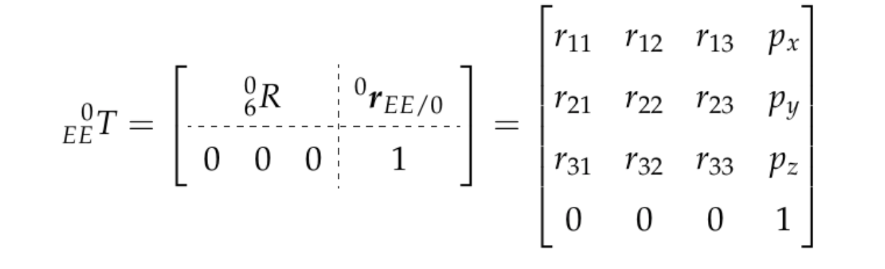
    
    * Because we chose to make Z_4 parallel to Z_6 and pointing from the WC to the EE, then this displacement is a simple translation along Z_6. The magnitude of this displacement (d), would depend on the dimensions of the manipulator and are defined in the URDF file. Further, since r13, r23, and r33 define the Z-axis of the EE relative to the base frame, the Cartesian coordinates of the WC is
    
    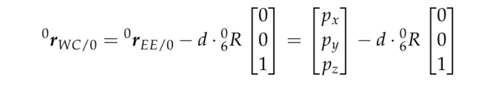    
    
    * Let's symbolically define the homogeneous transform first to help us visualize this better

    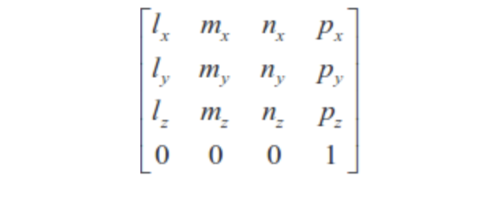    

    * l, m and n are orthonormal vectors representing the end-effector orientation along X, Y, Z axes of the local coordinate frame. And because the **n** vector runs along the gripper_links's Z axis, we can get it's position 
    
        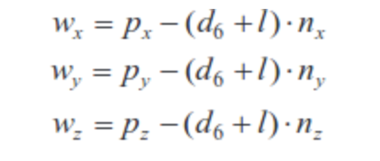    

        * **Px**, **Py**, **Pz** are EE positions
        * **Wx**, **Wy**, **Wz** are WC positions
        * **d6** is the displacement and can be obtained from the DH table
        * **l** is the end effector length which can also be obtained from the DH table
        
    * To do get the wrist center, we'll first need to create rotations about the x, y, and z axis and apply an x-y-z extrinsic rotation then accommodate for the difference in the robot design.
    
    * We'll generate the rotations for the given roll, pitch, and yaw.
    ```python
        R_x = Matrix([[1,      0,       0],
                      [0, cos(r), -sin(r)],
                      [0, sin(r),  cos(r)]]) # ROLL

        R_y = Matrix([[ cos(p), 0, sin(p)],
                      [      0, 1,      0],
                      [-sin(p), 0, cos(p)]]) # PITCH

        R_z = Matrix([[cos(y), -sin(y), 0],
                      [sin(y),  cos(y), 0],
                      [     0,       0, 1]]) # YAW
    ```
    
    * Perform an extrinsic rotation
    ```python
        R_EE = R_z * R_y * R_x      
    ``` 
    * Accommodate for the difference in design
    ```python
        R_Error = R_z.subs(y, pi) * R_y.subs(p, -pi/2)
        R_EE = R_EE * R_Error

    ```
	
    * Now that we have a corrected composition of rotations, we can solve for the WC
	
    ```python
        # End effector position
        EE = Matrix([[px],
                     [py],
                     [pz]])
        
        # Solve for WC position
        WC = EE - s[d7] * R_EE[:, 2]
    ```
Now that we have the WC position, we can now derive for the equations for the first three joints.

2. #####Solving for Joint 1, 2, and 3
    a. **Joint 1**
	
    	* Solving joint 1 is quite simple, we just need to project WC's Z axis onto the ground plane
    
    	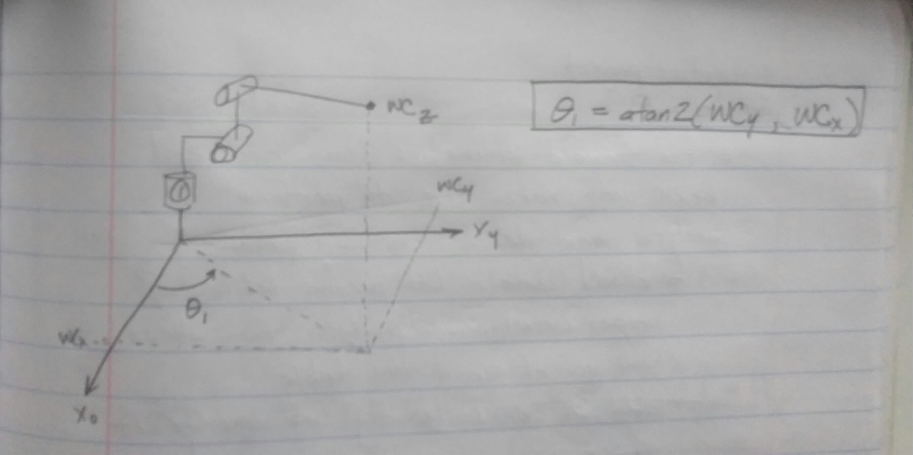
    
    	* Once we do, we can derive the following equation
    	

    	```python
    		theta1 = atan2(WC[1], WC[0])
    	```
    
    b. **Joint 2 and Joint 3**
	
    	* As mentioned in lecture, theta2 and theta3 are tricky to visualize. So the following diagram wil help us solve for these two angles:
    
        
        
        * First we'll get sides A, B, and C in the diagram
		```python
			xc, yc = sqrt(WC[0]**2 + WC[1]**2) - s[a1], WC[2] - s[d1]
			
			side_A = sqrt(s[a3]**2 + s[d4]**2)
			side_B = sqrt(xc**2 + yc**2)
			side_C = s[a2]
		```
		
        * The image explains how we solve theta2
		
        	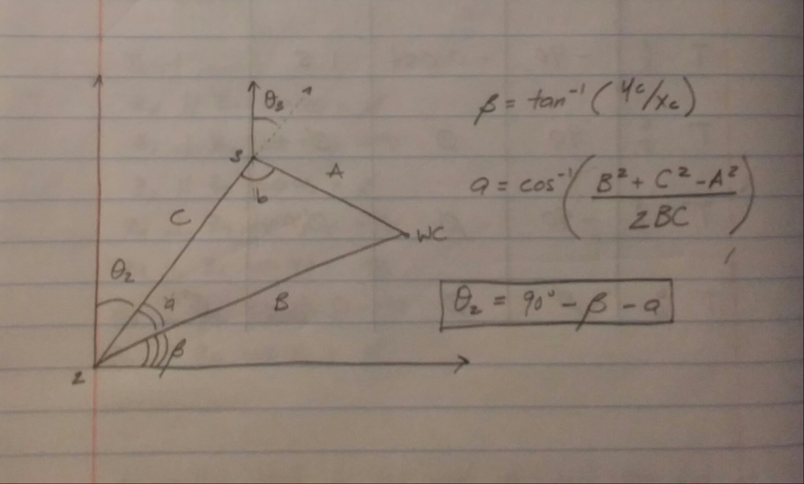
		
		* Solve for beta by taking the inverse tangent of yc over xc then solve for angle_a by using the Law of Cosine. After we can solve for theta2
		```python
			beta = atan2(yc, xc)
			angle_a = acos((side_B**2 + side_C**2 - side_A**2) / (2 * side_B * side_C))
			
			theta2 = pi / 2 - angle_a - beta
		```
		
		* Now for theta3, the image explains how we solve it
			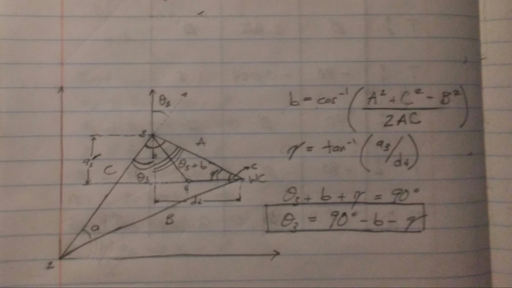
		* Similar to how we solved theta2, we'll calculate for angle_b and gamma to aid us on obtaining theta3
		```python
			gamma = atan2(s[a3], s[d4])
			angle_b = acos((side_A**2 + side_C**2 - side_B**2) / (2 * side_A * side_C))
			
			theta3 = pi/2 - angle_b - gamma
		```
    
3. ##### Solve for Joints 4, 5, and 6
    * Since we already calculated our individual transforms previously in the FK section, we can use that to solve for R0_3
     ```
        R0_3 = T0_1[0:3, 0:3] * T1_2[0:3, 0:3] * T2_3[0:3, 0:3]
     ```
     
     * Now we need the rotations from R3_6, to do that recall that since the overall RPY (Roll Pitch Yaw) rotation between base link and gripper link must be equal to the product of individual rotations between respective links, following holds true:
    	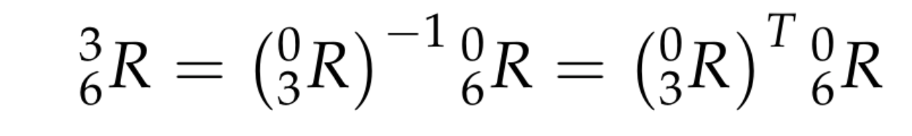     
     
     * We can substitute the values we calculated for joints 1 to 3 in their respective individual rotation matrices and pre-multiply both sides of the above equation by inv(R0_3) which leads to:
     ```
        R3_6 = R0_3.inv("LU") * R_EE
     ```
      
      * The resultant matrix on the RHS (Right Hand Side of the equation) does not have any variables after substituting the joint angle values, and hence comparing LHS (Left Hand Side of the equation) with RHS will result in equations for joint 4, 5, and 6.
      ```
        theta4 = atan2( R3_6[2, 2], -R3_6[0, 2])
        theta5 = atan2(sqrt(R3_6[2, 2]**2 + R3_6[0, 2]**2),  R3_6[1, 2])
        theta6 = atan2(-R3_6[1, 1],  R3_6[1, 0])        
      ```
      
      
4. ##### Now we choose the correct solution among the set of possible solutions
    
### Project Implementation

#### 1. Fill in the `IK_server.py` file with properly commented python code for calculating Inverse Kinematics based on previously performed Kinematic Analysis. Your code must guide the robot to successfully complete 8/10 pick and place cycles. Briefly discuss the code you implemented and your results. 
After having some help implementing IK, the script ran very slow due to its resource heavy calculations. So to optimize the performance I followed the recommended optimizations from lecture. I left the FK implementation and generic formulas outside the for loop since this doesn't need to be recomputed inside the for loop. I also avoided using the function **simplify** since this can increase computations. And finally I substituted any symbolic variables with their corresponding values before I multiplied any matrices.

Although the IK was still slow, the arm managed to work without any issues with the pick and place cycles. The only problem besides the arm being slow was that the gripper wouldn't grip the cylinder fully when I click 'continue', so when it performs the IK part, there would be no cylinder in the robot's gripper but it would perform the cycle as we can see in the image below:

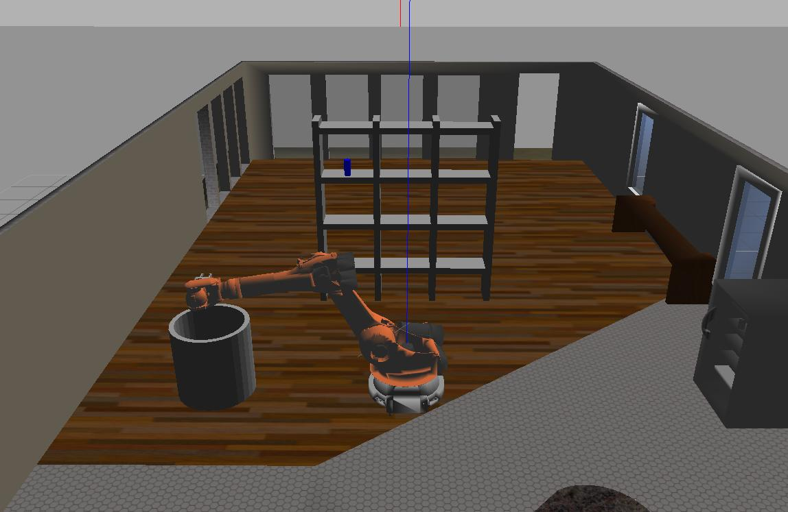    


I took care of this issue by adding this line of code:

```
	ros::Duration(2.0).sleep();
```

in the src/trajectory_sampler.cpp, as suggested in the Common Questions section of the project which made it possible to grasp more cylinders as we can see below, the arm managed to place 3 cylinders in a bin.

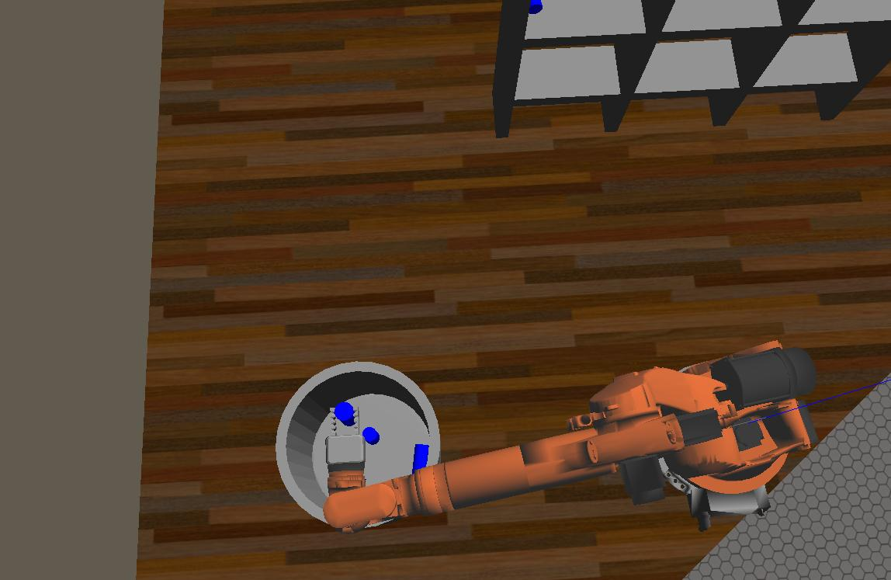    

Some improvements I would do after implementing the IK script, are simplifying the math formulas. There may be ways to solve IK using less expensive operators that I may not aware of, but the math operations behind this project seems to be the main choke point since it performs very heavy computations. Another work around is having a better machine that can handle these kind of computations.


